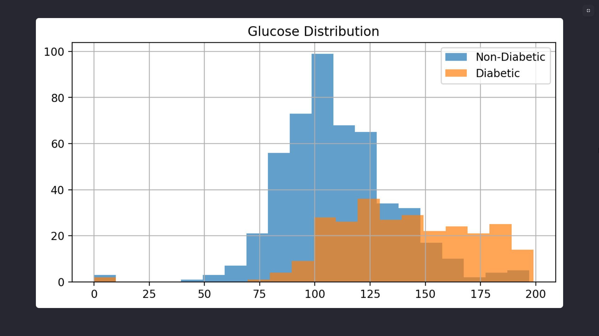
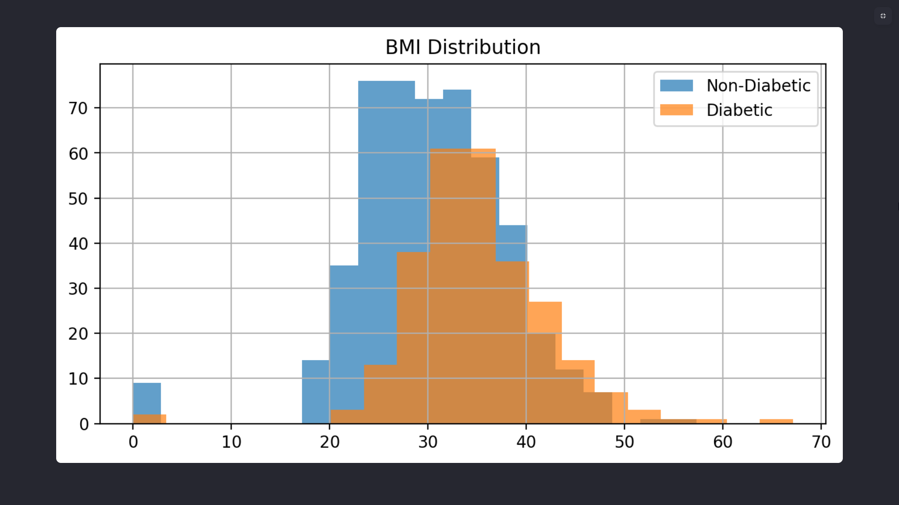
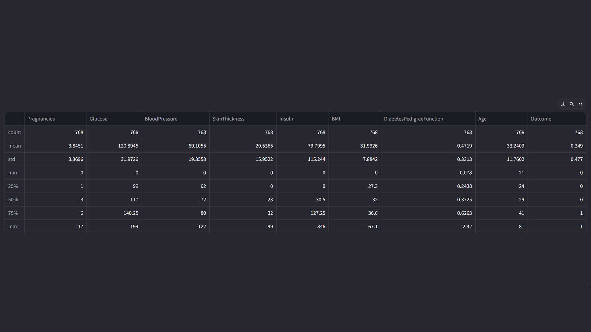
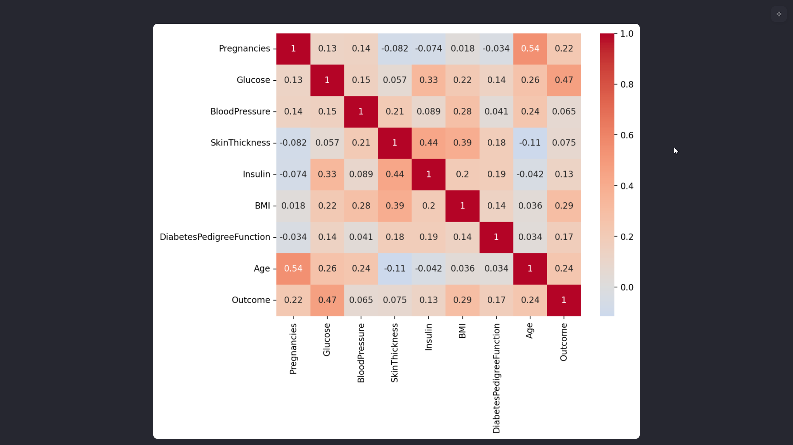
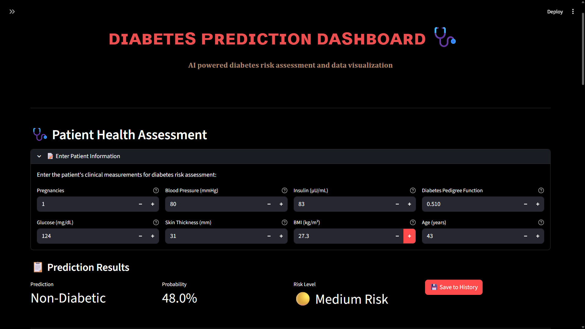
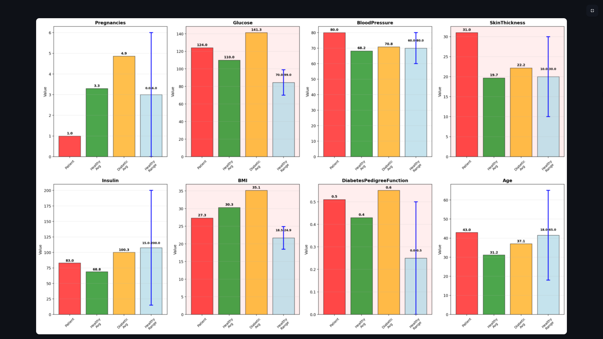

# Diabetes Risk Prediction with Random Forest  

[](https://www.python.org/)  
[](https://scikit-learn.org/stable/)  
[](https://streamlit.io/)  
[](https://pandas.pydata.org/)  
  

A complete machine learning pipeline for predicting diabetes risk using the **Pima Indians Diabetes dataset**.  

This project features:  
- A Random Forest classifier for baseline modeling  
- Standardized preprocessing with `StandardScaler`  
- Reproducible training and evaluation  
- A **CLI tool** for quick predictions  
- A **Streamlit dashboard** for interactive exploration and real-time inference  

⚠️ **Note:** This project is intended for **learning and benchmarking** only. It is **not** for clinical or medical use.  

---

## 📌 Overview  

**Goal**  
Predict the onset of diabetes from 8 health features and return an interpretable risk score.  

**Approach**  
- Train/test split  
- Feature standardization  
- Random Forest classification  
- Model persistence with Joblib  
- Simple deployment surfaces (CLI + Streamlit)  

**Outcome**  
Baseline accuracy in the **75–80% range** on held-out test data.  
Predictions include probability outputs to communicate risk, which aligns with common educational baselines reported in tutorials.  

---

## ✨ Key Features  

- 🌲 **Random Forest** with 100 trees and probability outputs (`predict_proba`) for risk communication  
- 🧰 End-to-end scripts: training, saving artifacts, and single-sample prediction via CLI  
- 🖥️ **Streamlit app**: dataset overview, feature distributions, correlations, and on-page predictions in a simple UI  

---

## 📊 Dataset  

- **Source:** Pima Indians Diabetes Database (768 rows, 8 predictors + Outcome)  
- **Features:**  
  - Pregnancies  
  - Glucose  
  - BloodPressure  
  - SkinThickness  
  - Insulin  
  - BMI  
  - DiabetesPedigreeFunction  
  - Age  
- **Target:** `Outcome` ∈ {0,1}  

---

## 📂 Project Structure  

- **Training:**  
  - Load dataset  
  - Scale features with `StandardScaler`  
  - Split into train/test sets  
  - Train Random Forest model  
  - Report accuracy, confusion matrix, and classification report  
  - Save model & scaler with Joblib  

- **Prediction (CLI):**  
  - Load saved model & scaler  
  - Accept typed input values  
  - Apply scaling  
  - Return class label + probability  

- **Streamlit app:**  
  - Show dataset stats, histograms, and correlation heatmap  
  - Provide instant predictions from user input  

---

## 🚀 How to Run  

### 🔧 Installation  

```bash
# Clone the repository
git clone https://github.com/luckychauhan7/diabetes-prediction-ml.git
cd diabetes-prediction-ml

# Install dependencies
pip install -r requirements.txt
```

### 🏗️ Train the Model  

```bash
python train_model.py
```

→ Produces `diabetes_model.pkl` and `scaler.pkl`  

### 🔍 Predict via CLI  

```bash
python predict_cli.py
```

→ Enter values interactively, see label + probability  

### 🌐 Launch Streamlit App  

```bash
streamlit run Diabetes-Prediction-by-Lucky-Chauhan.py
```

---

## 🖼️ Screenshots & Demo  

### 🔍 Dataset Exploration  
  
  
  

### 📊 Correlation Heatmap  
  

### ⚡ Real-time Prediction in Streamlit  
  
  

### 🎥 Demo (GIF)  
  

*(Add screenshots/GIFs inside an `images/` folder in your repo)*  

---

## 🧠 Modeling Notes  

- **Why Random Forest?**  
  Strong baseline for tabular data, robust to non-linearities and interactions, interpretable via feature importance  

- **Performance expectations**  
  Typical baselines: **mid-70s to mid-80s** accuracy without heavy tuning  
  Improvements come from imputation, class weighting, and hyperparameter search  

---

## ⚠️ Limitations  

<details>
<summary>📌 Educational Use Only</summary>
<p>
This project is for **educational purposes only**.  
It is not medical advice and must not be used in clinical practice.  
</p>
</details>

<details>
<summary>📌 Small Dataset</summary>
<p>
The dataset contains quirks such as **zero values** in physiological fields.  
This affects accuracy and limits reliability.  
</p>
</details>

<details>
<summary>📌 Cohort Constraints</summary>
<p>
The model is trained only on **adult Pima Indian females**.  
It cannot be assumed to generalize across other groups.  
</p>
</details>

---

## 🔮 Roadmap  

- 🔎 Add cross-validation & RandomizedSearchCV for more robust performance  
- 🎯 Calibrate probabilities for improved risk communication  
- 🪄 Add SHAP / feature importance explainability inside the Streamlit app  

---

## 📚 References  

- [Pima Indians Diabetes Database (UCI Machine Learning Repository)](https://archive.ics.uci.edu/ml/datasets/pima+indians+diabetes)  
- Comparable Random Forest + Streamlit implementations from community tutorials  
